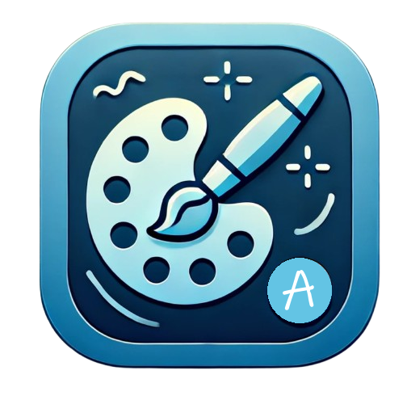
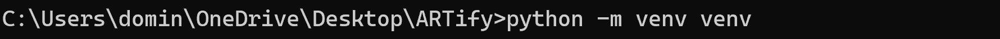
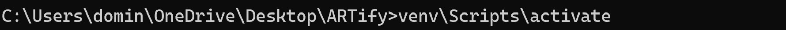
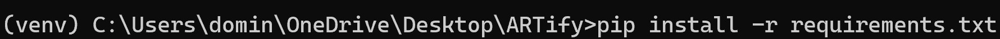
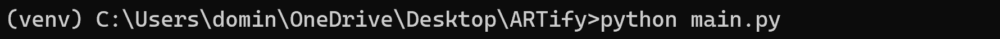
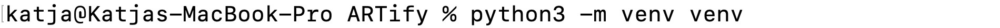
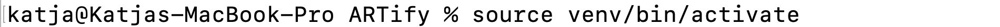
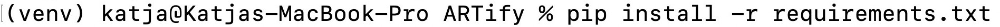

  

  

# 
  ARTify Studio 

ARTify Studio is a desktop application where users can upload images and apply various artistic styles leveraging deep learning. It supports customization options such as filters, image editing, and frames, as well as exporting the final images. This guide will walk you through the setup and use of the app.

- 🎴 Images reimagined in styles of Monet, Van Gogh, Cezanne, and Ukiyo-e.
- 🤖 Deep Learning powered Generative AI to apply styles to your images.
- 📵 Completely local, no internet connection needed.
- 🎨 Customize your images with filters, editing tools, and additional adjustments.
- 🖥️ Intuitive UI with easy-to-navigate sliders, dropdowns, and checkboxes.
- 💾 Save edited images to your gallery and export them in various formats.

---

## 💻 Installation - Windows

### 0. Prerequisite

Ensure you have **Python 3.8.5** or later installed on your system (*program tested for 3.8.5*). You can download Python from python.org.

### 1. Download the Program

Download or clone this repository.

### 2. Set up a Virtual Environment and install required libraries

Open Command Prompt and navigate to the project folder

Create a venv in the project folder 

    python -m venv venv

Activate the venv 

    venv\Scripts\activate

Within the venv, install required libraries 

    pip install -r requirements.txt

### 3. Launch ARTify Studio

If needed, open Command Prompt and navigate to the project folder

If needed, reactivate the venv 

    venv\Scripts\activate

Within the venv, execute 

    python main.py

Please note, that the first start can take up to a minute.

---

## 💻 Installation - macOS

### 0. Prerequisite

Ensure you have **Python 3.8.5** or later installed on your system (*program tested for 3.8.5*). You can download Python from python.org.

### 1. Download the Program

Download or clone this repository.

### 2. Set up a Virtual Environment and install required libraries

Open Terminal and navigate to the project folder

Create a venv in the project folder 

    python3 -m venv venv

Activate the venv 

    source venv/bin/activate

Within the venv, install required libraries 

    pip install -r requirements.txt

### 3. Launch ARTify Studio

If needed, open Terminal and navigate to the project folder

If needed, reactivate the venv 

    source venv/bin/activate

Within the venv, execute 

    python3 main.py

Please note, that the first start can take up to a minute.

---

## 📑 Using the App (Video Demo)

After starting the app, you’ll see the main navigation page with buttons to upload images, edit images, and view a gallery.

### 1. Upload Image

Select up to 12 images from your computer or choose sample images from the app's library. The selected images are then processed
by the machine learning model into their artistic styles, before the **Workspace** is displayed. Please refer to the acknowledgments
section below to learn more about the model.

Load images from your computer:

Choose sample images:

### 2. Workspace

Displays each image together with its style previews. The workspace is stored locally such that its content is persistent even if the app is restarted.

Click an image to start customizing it in real-time. In the editor, you can choose a style from the dropdown, adjust properties like brightness
and sharpness using sliders, and apply filters such as sepia, grayscale, or colorize. Finally, you can add frames or textures to enhance the image further
and export the images into your **Gallery**.

### 3. Gallery

Display all images and their stored edits. There are various options to view and export the edited images in a preferred format.
Like the workspace, the gallery is also stored locally.

---

## 📝 Repository Structure

Alongside this README, the repository includes:

- **Images for the README** in the `assets` folder.  
- **The license file**.  

The main project code is located in the folder **ARTify**.

1. **`CycleGAN/`**  
   Contains the files for the pretrained machine learning model used for artistic style transfer.  
   *Note:* This code was not written by the authors of this project (refer to the acknowledgments section). To save space, only the components required for this project are included.  

2. **`database/`**  
   Contains example images. After running the app, this folder will also contain user-generated content from the workspace and gallery.  

3. **`ui/`**  
   Houses the code for the layout and functionality of each page within the app.

4. **`utils/`**  
   Provides a utility script for utilizing the machine learning model within the app.

5. **`main.py`**  
   Serves as the entry point for the app. This script assembles the components from the other folders to create the final application.

6. **`requirements.txt`**  
   Lists the dependencies required to run the project.

---

## 💖 Acknowledgments

Thanks to all contributors and the open-source community.

### Contributors

This project has been created for the master's course **7,789: Skills: Programming with Advanced Computer Languages** taught by **Dr. Mario Silic** at the **University of St.Gallen (HSG)** in the **Autumn Semester 2024**.

- Katja Alison Zimmermann
- Dominik Manuel Buchegger

### About CycleGAN

CycleGAN is a generative model architecture used for image style transfer without needing paired examples of the original and target styles during training. In our application, we leveraged a CycleGAN with four pretrained models to apply artistic styles to images. We also used some images from the CycleGAN dataset for the app's example images.

- [Model architecture](https://github.com/junyanz/pytorch-CycleGAN-and-pix2pix)
- [Pretrained models](https://efrosgans.eecs.berkeley.edu/cyclegan/pretrained_models/)
- [Example images](https://efrosgans.eecs.berkeley.edu/cyclegan/datasets/)

CycleGAN is licensed under [BSD 2-Clause](https://opensource.org/licenses/BSD-2-Clause), which is why this project has the same license.

### Creation supported by ChatGPT

ChatGPT has been used througout the project, which enabled us to rapidly build an entire application around our image style transfer.

- Logo created by DALL·E
- Graphical user interface built with assistance from GPT-4o
- Image filter and editing functions created by GPT-4o
